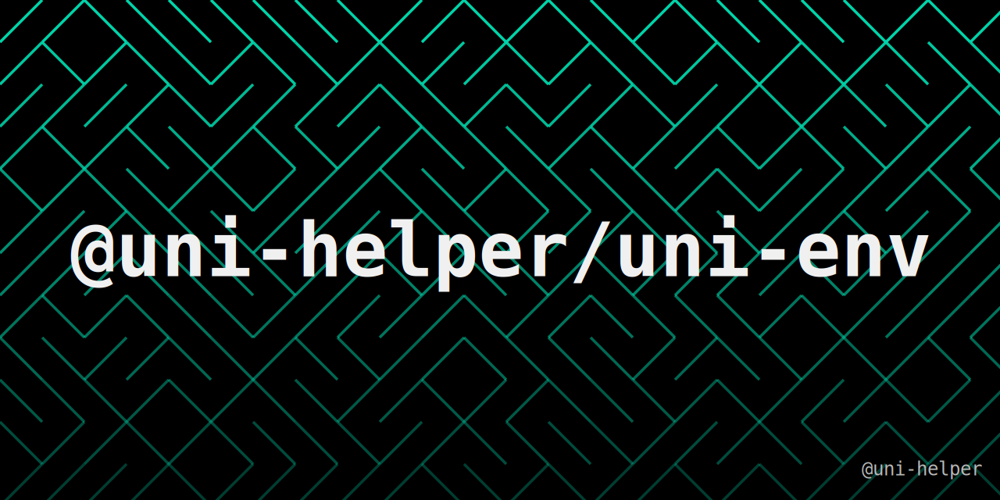

<a href="https://uni-helper.js.org/uni-env"></a>

<br >
<a href="https://github.com/uni-helper/uni-env/stargazers"></a>
<a href="https://www.npmjs.com/package/@uni-helper/uni-env"></a>
<a href="https://www.npmjs.com/package/@uni-helper/uni-env"></a>

在 uni-app 中优雅地判断当前环境。

## 安装

```bash
pnpm i @uni-helper/uni-env
```

## 使用

📖 **请阅读[完整文档](https://uni-helper.js.org/uni-env)了解完整使用方法！**

```ts
import { isMpWeixin } from '@uni-helper/uni-env'
```
